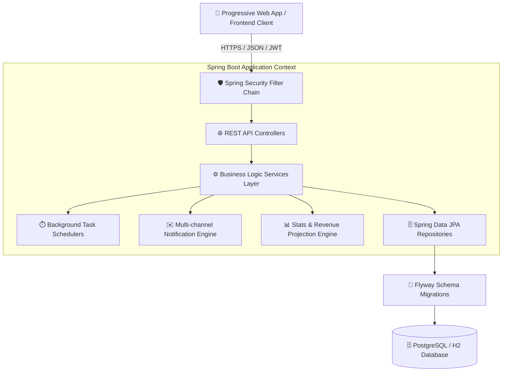

# 🐰 BunnyCure - REST API Backend Engine

[](https://openjdk.org/)
[](https://spring.io/projects/spring-boot)
[](https://spring.io/projects/spring-security)
[](https://www.postgresql.org/)
[](https://flywaydb.org/)
[](https://maven.apache.org/)

**BunnyCure Backend** es un motor de servicios REST desacoplado de alto rendimiento, diseñado para la gestión integral, calendarización, fidelización de clientes, facturación y automatización de salones estéticos y estudios de belleza.

Construido sobre **Spring Boot 3** y arquitectura en capas orientada al dominio (DDD), proporciona una API robusta, segura y escalable que da servicio a aplicaciones cliente Web/PWA y automatizaciones programadas.

---

## 🏗️ Arquitectura del Sistema

El backend opera bajo una arquitectura desacoplada (*Headless REST API*) asegurada mediante tokens stateless y control de acceso basado en roles:



---

## 🛠️ Stack Tecnológico

| Capa / Componente | Tecnología | Propósito |
|---|---|---|
| **Runtime & Core** | Java 17 LTS | Plataforma de ejecución principal |
| **Framework Base** | Spring Boot 3.2.11 | Inyección de dependencias, auto-configuración y ciclo de vida |
| **Capa Web** | Spring Web (REST) | Exposición de endpoints RESTful en formato JSON |
| **Seguridad** | Spring Security 6 & JWT | Autenticación stateless, hashing BCrypt y autorización basada en roles |
| **Persistencia** | Spring Data JPA / Hibernate 6 | Mapeo objeto-relacional (ORM) y repositorios de datos |
| **Base de Datos** | PostgreSQL (Prod) / H2 (Local/Test) | Almacenamiento relacional transaccional ACID |
| **Control de Esquemas** | Flyway Migration 9.22 | Versionado y control evolutivo del esquema de base de datos |
| **Mensajería & Notificaciones**| Spring Mail & Meta Cloud API Client | Despacho asíncrono de correos transaccionales y mensajería instantánea |
| **Monitoreo & Salud** | Spring Boot Actuator | Métricas de salud, estado de componentes y liveness checks |
| **Productividad** | Project Lombok | Reducción de código boilerplate mediante anotaciones |
| **Testing** | JUnit 5, AssertJ, Mockito, Spring Test | Pruebas unitarias, de integración y validación MockMvc |

---

## 📁 Estructura del Proyecto

```text
bunnycure/
├── src/
│   ├── main/
│   │   ├── java/cl/bunnycure/
│   │   │   ├── config/              # Configuraciones de seguridad, CORS, Datasource, Async y Schedulers
│   │   │   ├── domain/              # Entidades JPA, Enums de dominio y Repositorios de datos
│   │   │   │   ├── model/           # Entidades (Customer, Appointment, Service, Supply, GiftCard, etc.)
│   │   │   │   ├── enums/           # Enums (AppointmentStatus, Role, NotificationPreference, etc.)
│   │   │   │   └── repository/      # Interfaces Spring Data JPA
│   │   │   ├── service/             # Servicios de lógica de negocio transaccional
│   │   │   │   ├── impl/            # Implementaciones de servicios
│   │   │   │   └── notifications/   # Orquestación de notificaciones y recordatorios
│   │   │   ├── web/
│   │   │   │   ├── controller/      # Controladores REST API (@RestController)
│   │   │   │   └── dto/             # Data Transfer Objects (Requests, Responses y Summaries)
│   │   │   └── exception/           # Manejador global de excepciones (@ControllerAdvice)
│   │   └── resources/
│   │       ├── db/
│   │       │   ├── migration/       # Scripts SQL versionados para PostgreSQL (V1__... a V54__...)
│   │       │   └── migration-h2/    # Scripts SQL optimizados para entorno local y test H2
│   │       ├── application.properties
│   │       ├── application-local.properties
│   │       └── application-prod.properties
│   └── test/
│       └── java/cl/bunnycure/       # Suite de pruebas unitarias y de integración
├── pom.xml                          # Configuración de dependencias Maven
└── README.md
```

---

## ⚙️ Módulos y Capacidades del Negocio

1. **Gestión de Agenda & Citas:**
   - Creación, reprogramación, confirmación y cancelación de citas.
   - Cálculo automático de duración, bloques horarios y validación de solapamiento.
   - Bloqueo de fechas/horarios especiales y días festivos.

2. **Fidelización & Club de Sellos:**
   - Acumulación automatizada de sellos por visita atendida.
   - Ciclos continuos de premios y redención en la visita de recompensa.
   - DTOs optimizados para ranking de clientas más fieles.

3. **Catálogo de Servicios & Recetas de Insumos:**
   - Costeo de insumos por servicio para cálculo de margen bruto.
   - Descuento de stock en bodega al completar atenciones.
   - Manejo de insumos profesionales y control de inventario mínimo.

4. **Ficha Técnica de Clientes:**
   - Registro de datos de contacto, RUT, técnicas favoritas y notas de salud/alergias.
   - Almacenamiento seguro de historial fotográfico de atenciones.

5. **Automatizaciones & Notificaciones:**
   - Recordatorios automatizados mediante schedulers configurables.
   - Notificaciones transaccionales multicanal (Email y WhatsApp).
   - Manejo seguro de Webhooks de mensajería con verificación HMAC.

6. **Motor de Analítica & Finanzas:**
   - Desglose de ingresos reales percibidos versus proyectados mensuales.
   - Identificación de clientes top y ranking de servicios más solicitados.

---

## 🚀 Guía de Inicio Local

### Requisitos Previos
- **Java Development Kit (JDK):** Versión 17 o superior.
- **Apache Maven:** 3.9+ (o utilizar el wrapper `mvnw` incluido).
- **Git**

### 1. Clonar el Repositorio
```bash
git clone <URL_DEL_REPOSITORIO>/bunnycure.git
cd bunnycure
```

### 2. Configurar Variables de Entorno Locales
Copia o define las variables requeridas en tu entorno de desarrollo:

```bash
# Entorno y Perfil
export SPRING_PROFILES_ACTIVE=local

# Credenciales de Administrador Inicial (Bootstrap)
export BUNNYCURE_ADMIN_USERNAME=admin
export BUNNYCURE_ADMIN_PASSWORD=TuPasswordSeguraLocal123

# Configuración de Servidor
export PORT=8080
```

### 3. Compilar y Ejecutar Pruebas
```bash
mvn clean test
```

### 4. Iniciar la Aplicación
```bash
mvn spring-boot:run
```

La API estará disponible en `http://localhost:8080`.

---

## 🛡️ Seguridad y Buenas Prácticas

- **Stateless Authentication:** Todas las peticiones protegidas requieren cabecera `Authorization: Bearer <token>`.
- **CORS Configurado:** Control estricto de orígenes permitidos mediante configuración centralizada.
- **Control de Acceso (RBAC):** Restricciones granulares a nivel de método y endpoint (`ROLE_ADMIN`, `ROLE_STAFF`).
- **Protección de Datos:** Las contraseñas se almacenan con hashing BCrypt y factor de coste seguro.

---

## 🧪 Pruebas y Calidad de Código

El proyecto cuenta con una cobertura integral de pruebas automatizadas:

```bash
# Ejecutar suite completa de tests
mvn test

# Ejecutar verificación y empaquetado de producción
mvn clean package -DskipTests=false
```

---

## 📄 Licencia

Este proyecto es de uso privado y confidencial. Todos los derechos reservados.
